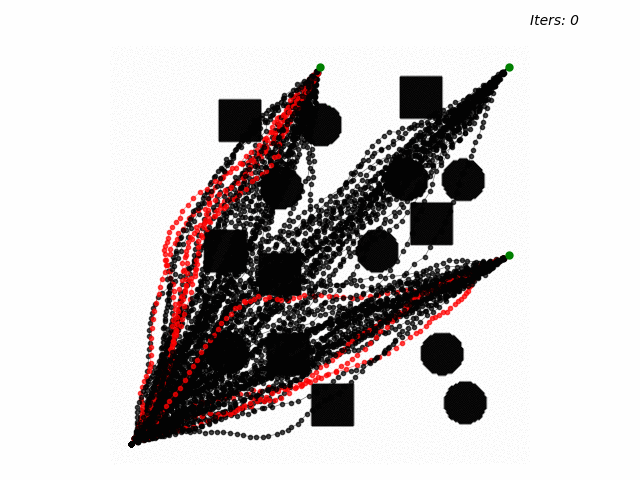

# mpot


# Accelerating Motion Planning via Optimal Transport





## Installation

Simply install this repos by

```azure
pip install -e .
```

## Examples

For the demo of paralleled planning in planar environment with 3 goals and 33 plans each (99 plans):

```azure
python examples/mpot_planar.py
```

Please find in `data/planar/` for the result in GIF.

See `examples/mpot_planar.py` for playing around with options and different goal points. Note that changing any parameters may require tuning again.
We tested the script on RTX 3080Ti GPU, with planning time 0.2-0.3 seconds.
