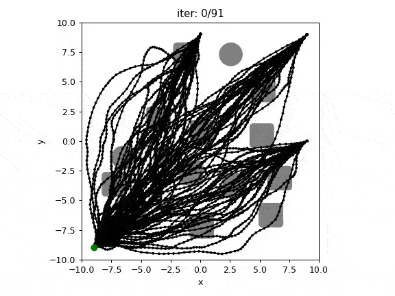
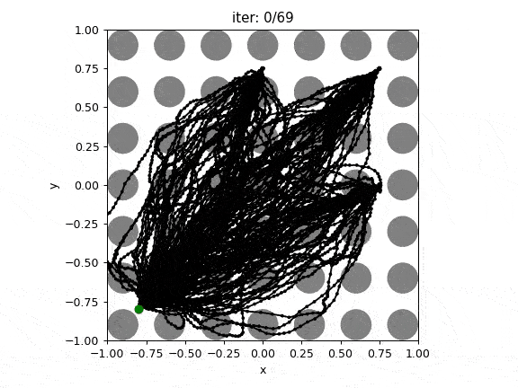
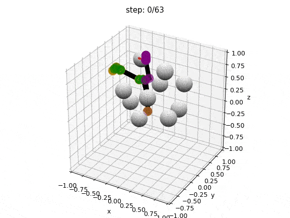

# Accelerating Motion Planning via Optimal Transport

[](https://arxiv.org/abs/2309.15970)
[](https://neurips.cc/virtual/2023/poster/71792)

This repository implements Motion Planning via Optimal Transport (`mpot`) in PyTorch.
The philosophy of `mpot` follows the Monte Carlo methods' argument: more samples discover more and better modes with high enough initialization variances.
Within the multi-modal motion planning scope, `mpot` performs **brute-force** parallel planning on GPU, mitigating local minima traps common in optimization-based motion planning.

<p float="middle">
  
  
  
</p>

For those interested in standalone Sinkhorn Step as a general-purpose batch gradient-free solver for non-convex optimization problems, please check out [ssax](https://github.com/anindex/ssax).

## Paper

This work has been accepted to **NeurIPS 2023**. Please find the paper on [arXiv](https://arxiv.org/abs/2309.15970).

## Requirements

- Python >= 3.9
- PyTorch >= 2.0 (with CUDA for GPU acceleration)
- See `pyproject.toml` for the full dependency list

## Installation

Activate your conda/virtual environment, navigate to the `mpot` root directory, and run:

```bash
pip install -e .
```

`mpot` requires GPU for practical performance. Please verify PyTorch CUDA support:

```bash
python -c "import torch; print(torch.cuda.is_available())"
```

## Examples

### Planar Occupancy Map

```bash
python examples/mpot_occupancy.py
```

### Planar Signed Distance Field (SDF)

```bash
python examples/mpot_sdf.py
```

### Panda Robot Arm (7-DOF, dense obstacles)

```bash
python examples/mpot_panda.py
```

Every run uses a **different random seed**. The resulting optimization visualizations are stored in the current directory.
Refer to the example scripts for playing around with options and different goal points.

> **Note:** For all cases, we normalize the joint space to the joint and velocity limits, then perform Sinkhorn Step on the normalized state-space. Changing any hyperparameters may require tuning again.

## Tuning Tips

The most sensitive parameters are:

| Parameter | Description | Guidance |
|---|---|---|
| `polytope` | Polytope geometry for directional probing | `cube` for dim < 10; `orthoplex` or `simplex` for higher dimensions |
| `step_radius` | Step size per iteration | Start small (0.03-0.15), increase if convergence is slow |
| `probe_radius` | Probing radius (must be >= `step_radius`) | Controls exploration range around current waypoints |
| `num_probe` | Probe points per polytope vertex | 3-5 is usually sufficient |
| `epsilon` | Decay rate of step/probe size | 0.01-0.05 typical |
| `ent_epsilon` | Sinkhorn entropy regularization | 1e-2 to 5e-2 balances coupling sharpness vs. speed |
| Cost weights | `w_coll`, `w_smooth` | Application-dependent; tune for your environment |

## Troubleshooting

**CUDA Memory Issues:**
```bash
export PYTORCH_CUDA_ALLOC_CONF=max_split_size_mb:512
```

**Common Issues:**
- If optimization diverges, reduce `step_radius` and `probe_radius`
- For high-dimensional problems (e.g., 7-DOF robot), use `orthoplex` polytope to reduce vertex count
- Reduce `num_particles_per_goal` if running out of GPU memory

## Acknowledgement

The Gaussian Process prior implementation is adapted from Sasha Lambert's [`mpc_trajopt`](https://github.com/sashalambert/mpc_trajopt/blob/main/mpc_trajopt/factors/gp_factor.py).

## Citation

If you found this repository useful, please consider citing:

```bibtex
@inproceedings{le2023accelerating,
  title={Accelerating Motion Planning via Optimal Transport},
  author={Le, An T. and Chalvatzaki, Georgia and Biess, Armin and Peters, Jan},
  booktitle={Advances in Neural Information Processing Systems (NeurIPS)},
  year={2023}
}
```
